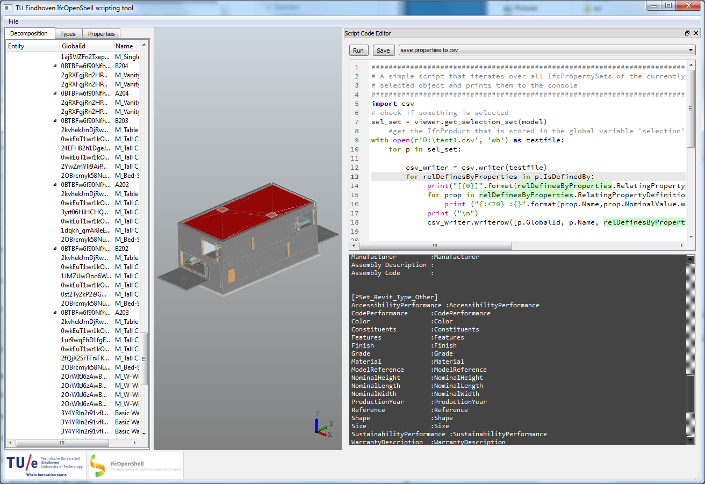

# IfcOpenShell Scripting Tutorial 

This repository contains tutorial to learn scripting your own applications for processing Industry Foundation Classes (IFC) files. It is based on a scriptable viewer tool that uses the [IfcOpenShell](http://ifcopenshell.org) toolkit. The scriptable viewer tool has been created for teaching purposes and is used at the [Eindhoven University at Technology](https://www.isbe.tue.nl) and the [RWTH Aachen University](http://caad.arch.rwth-aachen.de) .  

A packaged __binary version of the tool__ is available at [this location]( http://caad.arch.rwth-aachen.de/download/rwth_viewer.zip )(175 MB!) to get you started. It comes with "all batteries included", including python, IfcOpenShell and the Python OpenCascade wrappers.

Follow these simple steps to 'install' the viewer/scripting application:

  - Download tue_viewer.zip (175 MB) and the [snippets configuration file](https://raw.githubusercontent.com/jakob-beetz/IfcOpenShellScriptingTutorial/master/src/snippets.conf) which contains a few example snippets to get you started.
  - in your home directory (e.g. C:/Users/yourname) create a directory called ".ifcopenshell" in this create another directory called "app" and place the snippets.conf there (Note, if you have started the application once allready, you will find the directory structure and a default snipptes.conf there. You can overwrite this)
  - Unpack tue_viewer.zip and start the viewer by double-clicking start_viewer.cmd
  - Follow the tutorial in [this wiki](https://github.com/jakob-beetz/IfcOpenShellScriptingTutorial/wiki/Home)
